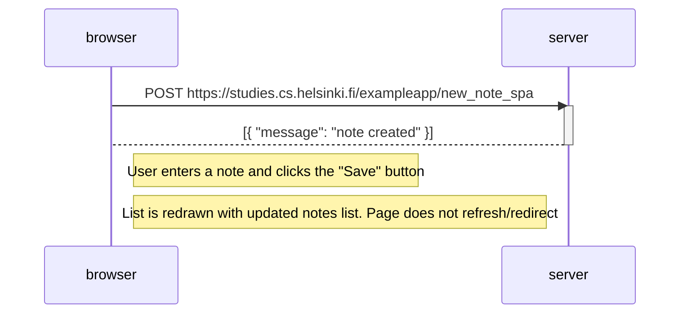

```mermaid
sequenceDiagram
    participant browser
    participant server

    browser->>server: POST https://studies.cs.helsinki.fi/exampleapp/new_note_spa
    activate server
    server-->browser: [{ "message": "note created" }]
    deactivate server
    Note right of browser: User enters a note and clicks the "Save" button

    Note right of browser: List is redrawn with updated notes list. Page does not refresh/redirect

```
